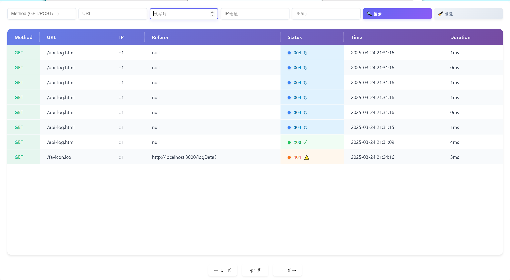

# Express Logger

一个简单的Express中间件,用于将HTTP请求日志记录到SQLite数据库,并提供基于Web的可视化界面。

## 特性

- 记录HTTP请求详情,包括请求方法、URL、IP、来源页、状态码、时间戳和响应时间
- 将日志存储在SQLite数据库中
- 提供Web界面查看和搜索日志
- 支持分页浏览
- 支持多个过滤条件筛选日志

## 日志界面

访问 `/logData` 路径即可打开日志查看界面,支持以下功能:

- 按请求方法、URL、状态码等条件搜索
- 分页浏览日志记录  
- 直观的状态码显示
- 响应时间统计

##### 界面预览



## 安装

```bash
npm install expresslogger
```

## 使用方法

```javascript
const expressLog = require("expresslogger");

// 初始化日志中间件,传入日志文件存储路径
const logger = expressLog("/log"); 

// 将日志中间件添加到Express应用
app.use(logger);
```

## License

[MIT](LICENSE)